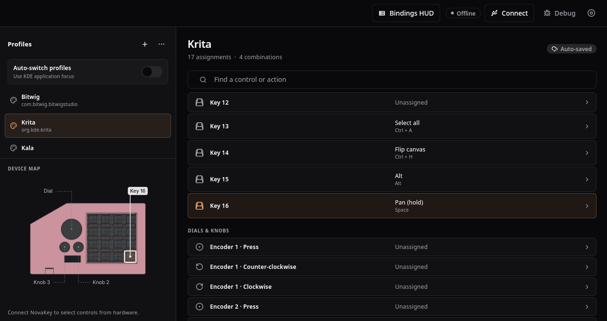

# NovaKey

An open-source 16-key macropad with three rotary encoders, custom firmware, and a companion configuration app.

## Novakey studio

Studio is the desktop app for the novakey. It can be used to configure profiles and keybinds

